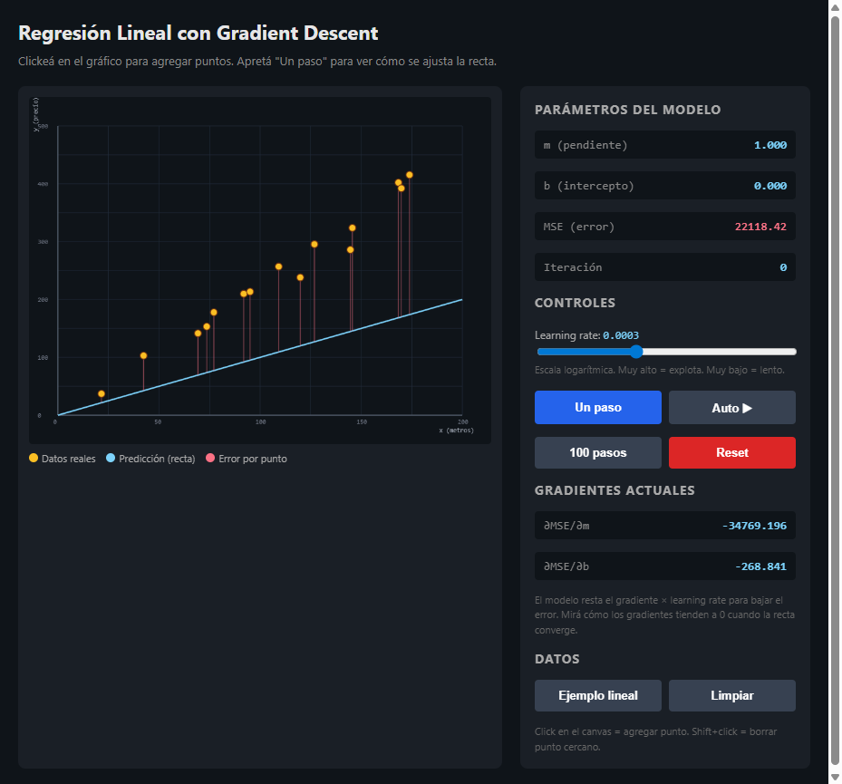
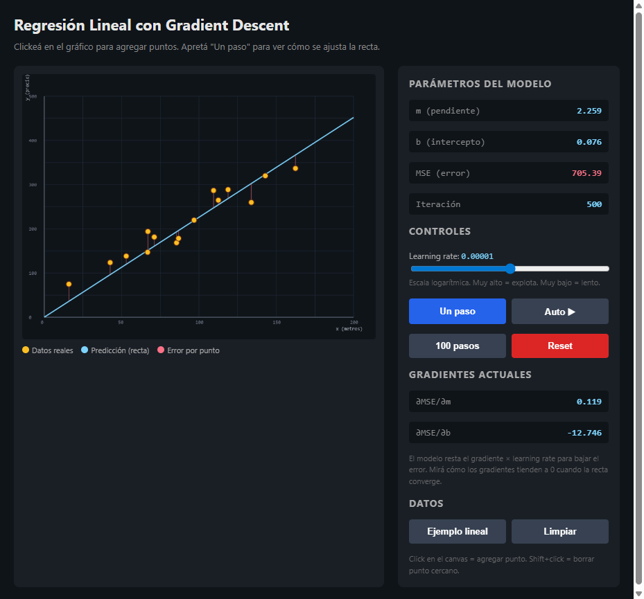
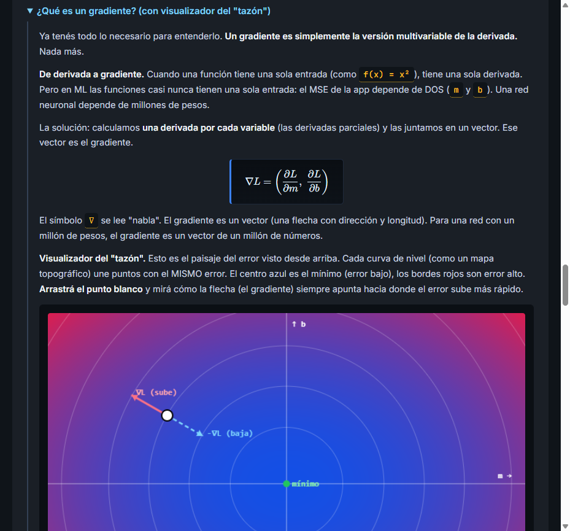

# Regresión Lineal con Gradient Descent

> Proyecto **educativo** para aprender cómo funciona por dentro la regresión lineal y el descenso de gradiente. Todo en una sola página HTML, sin build, sin dependencias pesadas.

Visualizador interactivo de **regresión lineal** entrenada con **descenso de gradiente**. Pensado para entender de verdad qué hace el optimizador paso a paso — no sólo ver la recta final. Está todo en español y apunta a alguien que recién arranca con machine learning y quiere ver la matemática en acción.

**Demo en vivo:** https://joajo13.github.io/regresion-lineal-interactiva/

## Para qué sirve

- Tenés un dataset de puntos 2D y querés ver cómo se ajusta una recta `y = m·x + b`.
- Querés entender **qué es un gradiente** y por qué se resta en lugar de sumarse.
- Querés ver con los ojos el famoso "tazón" de la función de error (curvas de nivel) y la flecha del gradiente apuntando cuesta arriba.
- Sos profe / tutor / estudiante y necesitás una demo que se pueda tocar en vivo.

## Qué tiene

- Canvas interactivo: clickeá para agregar puntos y la recta se ajusta sola.
- Controles de **learning rate**, pasos manuales, reset y dataset de ejemplo.
- Métricas en tiempo real: pendiente (m), intercepto (b), loss (MSE) y gradientes ∂L/∂m y ∂L/∂b.
- Sección de teoría con derivadas, gradiente y un **visualizador del "tazón"** (curvas de nivel del error) donde se ve la flecha del gradiente apuntando cuesta arriba.
- Fórmulas renderizadas con KaTeX, tipografía JetBrains Mono para el código y Inter para el texto.

## Preview







## Cómo correrlo local

No hay build. Abrí `index.html` en el browser y listo. Si preferís un server:

```bash
python -m http.server 8000
# o
npx serve .
```

## Stack

- HTML + CSS + JS vanilla, cero dependencias de build.
- [KaTeX](https://katex.org/) vía CDN para las fórmulas.
- Google Fonts (Inter + JetBrains Mono).

## Licencia

MIT.
